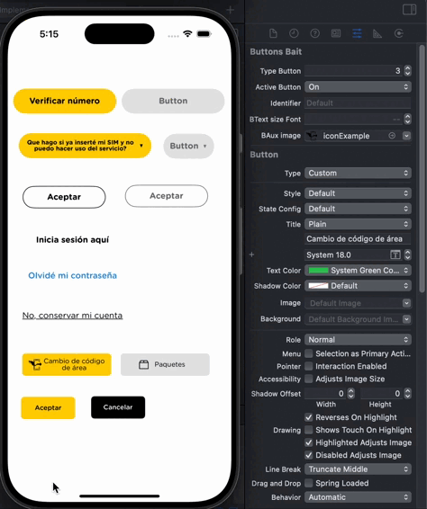

# View Manager


[](#swift-package-manager)
[](https://developer.apple.com/swift/)


View Manager es un paquete que facilita la implementación de los componentes al diseñar las aplicaciones iOS



## Requirements
* Xcode 8 o posterior
* iOS v14.0 o posterior

## Installation
### Swift Package Manager

Para instalar el paquete, puedes agregar el siguiente enlace en el campo de dependencias de [Swift Package Manager](https://swift.org/package-manager/)

## Example

### Swift

Paso 1:
Importar el paquete y registrar las fuentes.
Para registrar las fuentes escribimos el siguiente código dentro del método "didFinishLaunchingWithOptions"

``` swift
import ViewManagerSP

func application(_ application: UIApplication, didFinishLaunchingWithOptions launchOptions: [UIApplication.LaunchOptionsKey: Any]?) -> Bool {
    FontManager.registerFonts()
    return true
}
```

Paso 2:
Importar el paquete a la clase donde se vayan a referenciar los elementos visuales

``` swift
import ViewManagerSP
    
@IBOutlet weak var buttonExample: VMButtonsBait!
``` 
    
Todos los componentes tienen propiedades @IBInspectables, las cuales se puede ir configurando en el interface builder dentro de la vista inspector de atributos.

## Components
Los tipos de componentes que contiene este paquete son:

- [x] VMButtonsBait - Botones
- [ ] ...
    
## Documentation
Las configuraciones de los componentes se pueden encontrar en el siguiente link:

* <https://docs.google.com/spreadsheets/d/1SujiHi-vd24x81BowRtquOSBaNnsxjFe6FqV9jjPHVg/edit?usp=sharing>
    
## Author
Ignacio Hernández, ignacio.hernandez@ordenaris.com

## 📄 License
OrdenarisPayments is available under the MIT license.
See [LICENSE](./LICENSE) for details.
